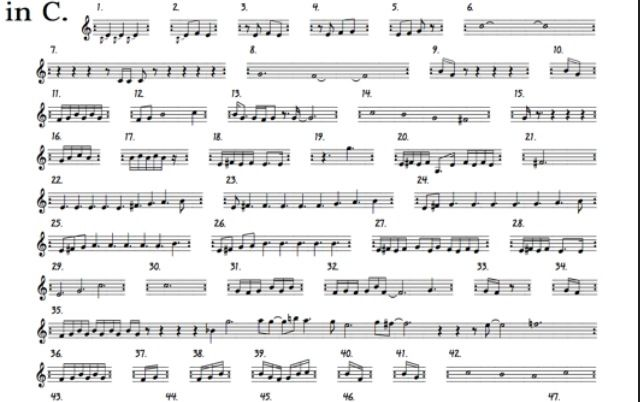

# in-python

An attempt at a Pseudo-random generator for arrangements for Terry Riley's progressive composition "In C", in `python3`, with my lamely-named play on the more popular version of this project, [In CPlusPlus](https://github.com/gregwht/InCplusplus), which is an awesome name, and a way better job than I am likely to do.

My (likely flawed) understanding of In C is that it empowers the musicians playing the piece to choose the arrangement, as opposed to the traditional approach of a conductor dictating the tempo and feel of a piece. The premise is as follows: From the sheet music provided, a section will be repeated until the musicians _choose_ to move on from it. When a group of instruments does this, a different group does not necessarily need to move to the next section, but there is a suggestion to not be more than 2 or 3 sections behind or ahead of any other group. In this way, the piece is played "in the round" likely never being played the same way twice.

The sheet music is simple:

This seems like a good candidate for [Algorithmic Compisition](https://en.wikipedia.org/wiki/Algorithmic_composition) - given a few simple parameters, we can produce, with sheet music, a permutation of In C. It's easy to get your head around and doable as a first attempt at this sort of project, with the result of a unique piece each time, or at least nearly every time.

### Disclaimer

I am not sure of the capabilities of the python libraries available to manipulate MIDI sounds, so this may not really be possible with this approach and could all just be fluff and a working project might not happen

### Desired Features && Parameters

 - How many instruments are performing the piece?
 - What instruments are playing?
 - How many times are they allowed to repeat a section?
 - What is the tempo?
 - What is the key?
 - What are the effects saturation for each section? Delay, reverb, flanger, autowah, etc etc etc, whatever can be virtualized.
 - What is the velocity for each note being played?

 Almost certainly there is more stuff here to be figured out.

### Dependencies

This is intended to be run with python3 and uses the [music21 python module](https://github.com/cuthbertLab/music21)

`sudo pip3 install music21`
